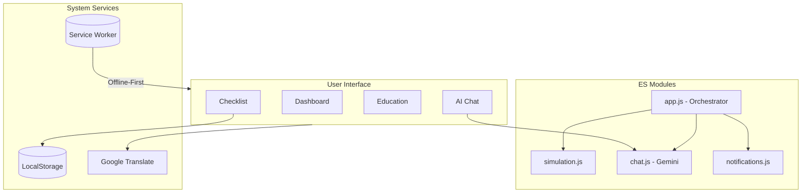

# Electo AI India 🇮🇳

**Electo AI India** is a Progressive Web Application (PWA) designed to serve as an interactive educational hub and a real-time dashboard for the Indian Election System. Built entirely using Vanilla Web Technologies (HTML, CSS, JS), it demonstrates offline-first capabilities, interactive simulations, and multi-language support.

**Live Demo:** [https://electo-ai-253016050079.asia-south1.run.app](https://electo-ai-253016050079.asia-south1.run.app)

---

---

## 🚀 Technical Excellence

Electo AI is built with a focus on professional software standards, security, and inclusive design.

### 🏗️ Modular Architecture
- **ES Modules:** The application is entirely refactored into ES6 Modules, ensuring clean namespace management and efficient dependency handling.
- **JSDoc Documentation:** Every function and design token is documented using JSDoc standards for maximum maintainability.
- **Dynamic Imports:** Utilizes code-splitting and dynamic `import()` for optional features like the Google Gemini AI, reducing initial load times.

### ♿ Accessibility (WCAG 2.1 Compliance)
- **Multi-Theme Support:** Features a dedicated **Dark/Light Mode** toggle to accommodate users with different visual needs.
- **Keyboard Navigation:** Implements a "Skip to Content" link and strict `tabindex` management for a fully keyboard-accessible experience.
- **Semantic HTML:** All interactive elements use appropriate ARIA roles and labels for screen-reader compatibility.

### 🛡️ Security & Performance
- **Input Sanitization:** Uses `textContent` and `documentFragment` exclusively for dynamic content, providing robust protection against XSS.
- **Content Security Policy (CSP):** Implements a restrictive CSP meta tag to prevent unauthorized script execution.
- **Offline-First (PWA):** Robust Service Worker implementation with advanced caching strategies for 100% offline functionality.

### 🧪 Automated Quality Assurance
- **Validation Dashboard:** A dedicated `/tests.html` suite performs real-time integrity checks on state management, data schemas, and PWA readiness.

---

## 🌟 Key Features
- **AI Election Assistant:** Powered by **Google Gemini 1.5 Flash**, providing context-aware answers with local knowledge base fallback.
- **Interactive EVM Simulator:** A high-fidelity Electronic Voting Machine simulation with VVPAT paper trail animation and audio feedback.
- **Real-Time Dashboard:** Simulated crowd density monitoring and booth queue estimation.
- **Smart Checklist:** Personalized voter preparation guide with LocalStorage persistence.
- **Multilingual Support:** Instant Hindi/English toggle via Google Translate API integration.

---

## 🏗️ Logic & Data Flow



---

## 🎯 Chosen Vertical
**Election Process Education & Support**
This project targets the democratization of information. By simplifying complex election procedures and providing real-time simulated guidance, Electo AI aims to increase voter turnout and reduce friction at polling stations.

## 📌 Assumptions Made
- **Data Availability:** The real-time dashboard logic assumes that a crowdsourced or official API for booth congestion would be available in a production scenario.
- **Modern Browsers:** The app assumes users have access to browsers that support Service Workers and the Web Audio API (for the EVM beep).
- **One-Time Sync:** It assumes the user has internet access at least once to "install" the PWA and load the translation scripts.

---

## 🚀 Running Locally

Because the application is built with standard web technologies, there are no heavy frameworks or build steps required.

1. **Clone the repository:**
   ```bash
   git clone https://github.com/ankitpanwar15/Electo-AI.git
   cd Electo-AI
   ```

2. **Start a local web server:**
   You can use Python or any simple HTTP server to avoid CORS issues with the Service Worker.
   ```bash
   # Using Python 3
   python -m http.server 8080
   ```

3. **Open in browser:**
   Navigate to `http://localhost:8080`

---

## 🧪 Testing & Validation

To ensure the highest level of reliability and security, Electo AI includes a dedicated **Automated Test Dashboard**. 
- **View Tests:** Open `tests.html` in your browser or click the vial icon in the sidebar.
- **Scope:** Validates Geolocation logic, LocalStorage persistence, Quiz data integrity, and Service Worker registration.

---

## 🔒 Security & Accessibility
- **XSS Protection:** All user-generated content and AI responses are sanitized using `textContent` to prevent script injection.
- **Credential Safety:** API keys are stored in `localStorage` and handled via `password` masked inputs.
- **Accessibility:** Fully navigable via keyboard (`Tab`, `Enter`, `Space`) with descriptive ARIA roles for screen readers.

---

## ☁️ Deployment

The application includes a `Dockerfile` utilizing an `nginx:alpine` image to serve the static content.

**Deploy to Google Cloud Run:**
```bash
gcloud run deploy electo-ai --source . --region asia-south1 --allow-unauthenticated --port=8080
```

---

## 📝 License

This project is for educational purposes. Feel free to use and modify it.

Built with ❤️ by Antigravity AI Assistant.
