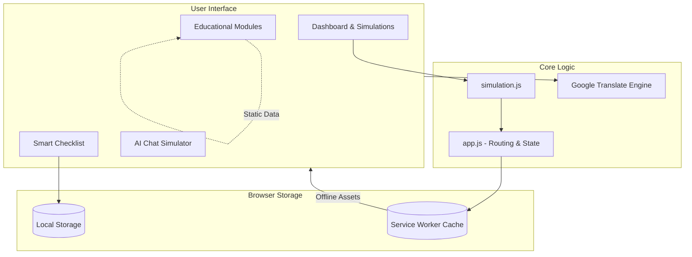

# ElectSmart India 🇮🇳

**ElectSmart India** is a Progressive Web Application (PWA) designed to serve as an interactive educational hub and a real-time dashboard for the Indian Election System. Built entirely using Vanilla Web Technologies (HTML, CSS, JS), it demonstrates offline-first capabilities, interactive simulations, and multi-language support.

**Live Demo:** [https://electsmart-253016050079.us-central1.run.app](https://electsmart-253016050079.us-central1.run.app)

---

## 📸 Screenshots

| Real-Time Dashboard | My Voter Checklist |
| :---: | :---: |
|  |  |

| AI Election Assistant | Learn the System |
| :---: | :---: |
|  |  |

| Knowledge Quiz | |
| :---: | :---: |
|  | |

---

## 🌟 Key Features

1. **Real-Time Dashboard & Simulation**
   - Live crowd density mapping for various polling zones.
   - Dynamic polling place wait time estimations.
   - **Smart Booth Locator:** Finds your nearest booth and suggests the best time to vote based on live density.

2. **Personalized Smart Checklist**
   - An interactive task manager to track voter deadlines.
   - Progress is automatically saved locally in your browser.

3. **Interactive Education Hub**
   - **EVM & VVPAT Simulator:** An interactive mock voting machine complete with audio feedback and a printed VVPAT slip animation.
   - **Polling Booth Layout Model:** A visual map of the typical polling station and officer responsibilities.
   - **Process Timeline:** A step-by-step breakdown of the election cycle.
   - **Flashcards:** Flippable cards for key election terminology.
   - **Knowledge Quiz:** A scored, multiple-choice quiz with immediate feedback.
   - **Valid IDs Guide:** A grid of all 11 ECI-approved alternative identity documents.

4. **AI-Powered Chat Assistant**
   - A simulated chatbot capable of answering questions about the election process.

5. **PWA Capabilities & Notifications**
   - Works fully **offline** thanks to a custom Service Worker.
   - Supports native browser Push Notifications for urgent alerts.

6. **Seamless Language Toggle**
   - Real-time dynamic translation between **English** and **Hindi** via the Google Translate API, translating both static content and dynamically injected components.

---

## 🏗️ Architecture

Below is a high-level representation of the application's component architecture and data flow:



---

## 🚀 Running Locally

Because the application is built with standard web technologies, there are no heavy frameworks or build steps required.

1. **Clone the repository:**
   ```bash
   git clone https://github.com/ankitpanwar15/electsmart.git
   cd electsmart
   ```

2. **Start a local web server:**
   You can use Python or any simple HTTP server to avoid CORS issues with the Service Worker.
   ```bash
   # Using Python 3
   python -m http.server 8080
   ```

3. **Open in browser:**
   Navigate to `http://localhost:8080`

---

## ☁️ Deployment

The application includes a `Dockerfile` utilizing an `nginx:alpine` image to serve the static content.

**Deploy to Google Cloud Run:**
```bash
gcloud run deploy electsmart --source . --region us-central1 --allow-unauthenticated --port=80
```

---

## 📝 License

This project is for educational purposes. Feel free to use and modify it.

Built with ❤️ by Antigravity AI Assistant.
